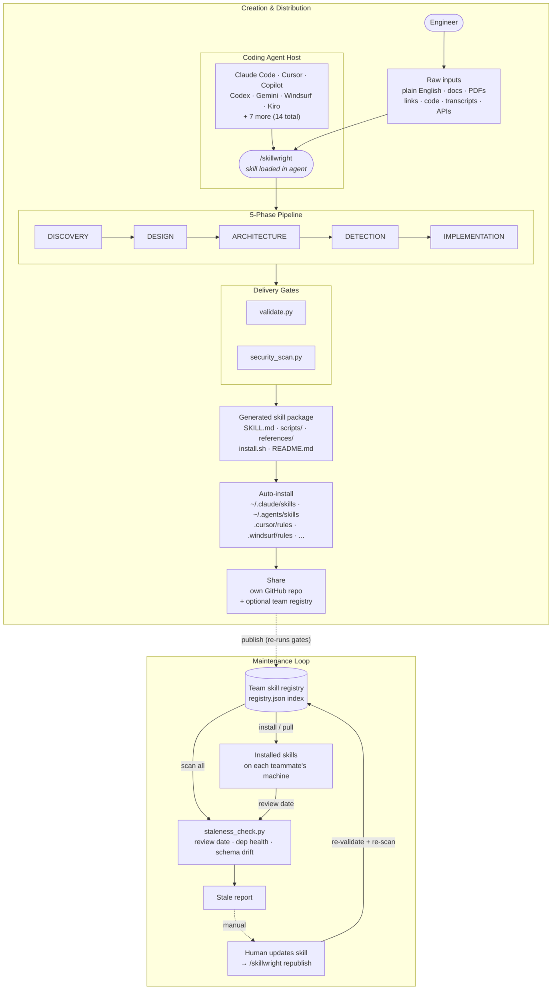

# Skillwright

## Quick Start

### 1. Install

```bash
# One-liner — installs to every detected tool
curl -fsSL https://raw.githubusercontent.com/johnsonafool/skillwright/main/scripts/bootstrap.sh | sh
```

Or clone manually (pick your tool's path):

```bash
# Claude Code + VS Code Copilot (shared)
git clone https://github.com/johnsonafool/skillwright.git ~/.claude/skills/skillwright

# Codex / Gemini / Kiro / Antigravity (universal path)
git clone https://github.com/johnsonafool/skillwright.git ~/.agents/skills/skillwright

# Cursor (per-project)
git clone https://github.com/johnsonafool/skillwright.git .cursor/rules/skillwright
```

Already cloned? `./install.sh` symlinks to all detected platforms (`--dry-run`, `--uninstall` supported). See [All Platforms](#all-platforms) for the full matrix.

### 2. Use it

Open your agent and type `/skillwright` followed by your source material. **This is not a prompt template** — Skillwright opens files, fetches URLs, extracts PDFs, and analyzes code, then builds a spec from what it actually finds (not just your description).

Pass any input type, or combine several in one message:

| Input | Example invocation |
|---|---|
| **Plain English** | `/skillwright Every week I pull sales data from our CRM, dedupe, compute regional totals, and generate a PDF report.` |
| **Doc / wiki link** | `/skillwright Based on our deployment runbook: https://wiki.internal/deploy-process` |
| **Existing code** | `/skillwright See scripts/invoice_processor.py — turn it into a reusable skill.` |
| **PDF** | `/skillwright Using compliance-checklist.pdf, build a skill for SOX audits.` |
| **API docs** | `/skillwright Here are our API docs: https://api.internal/docs — make a skill to query inventory.` |
| **Database schema** | `/skillwright Read schema.sql; create a skill that generates monthly finance reports from it.` |
| **Meeting transcript** | `/skillwright transcripts/standup-q1.txt — extract the deploy runbook we described and turn it into a skill.` |
| **Whole directory** | `/skillwright Look at ./migrations/ — build a skill that runs a dry-run migration plan.` |
| **Multi-source combo** | `/skillwright See runbook.md + scripts/deploy.py + https://status.internal/api — build a one-command deploy skill.` |

The more sources you pass, the tighter the generated skill. Skillwright reconciles them into a single internal spec before writing any code.

### 3. What you get

```
sales-report-skill/
├── SKILL.md          # Definition (activates with /sales-report-skill)
├── scripts/          # Functional code
├── references/       # On-demand docs
├── assets/           # Templates, configs
├── install.sh        # Cross-platform installer (14 tools)
└── README.md
```

The skill auto-installs on your platform and tells you how to invoke it. The generated `install.sh` handles all 14 tools, auto-generates format adapters for Cursor (`.mdc`) and Windsurf, and creates a `~/.agents/skills/` symlink for cross-tool discovery.

---

## How It Works

Humans describe what they *do*, not what they *need*. Skillwright uncovers implicit requirements (who reads the output, what format, what happens on missing data) before writing code. Every skill is validated (structure, naming, metadata) and security-scanned (no keys, credentials, injection risks) before delivery — staleness checks run post-install as part of the maintenance loop.



---

## Share Across Your Team

After building, the agent offers to create a repo and push. You get a one-liner to share:

```
git clone https://github.com/your-org/sales-report-skill.git ~/.agents/skills/sales-report-skill
```

Paste on Slack. Colleague pastes in terminal. Done. One install at `~/.agents/skills/` covers Codex, Gemini, Kiro, and Antigravity at once.

### Team skill registry

When you have more than a few skills, set up a shared registry — one git repo where everyone publishes and browses:

```bash
python3 scripts/skill_registry.py init --name "Acme Corp Skills"
python3 scripts/skill_registry.py publish ./sales-report-skill/ --tags sales,reports
python3 scripts/skill_registry.py list
python3 scripts/skill_registry.py install sales-report-skill
```

Just a git repo on GitHub or GitLab — no servers, no databases.

**For consultants:** the engagement model is *teach, not build*. Install the creator on each machine, set up the team registry, teach the install → create → publish → install loop, and leave behind a self-sustaining system.

---

## All Platforms

Skills are authored as **SKILL.md** (the open standard). The installer handles any format conversion.

| Tier | Platforms | Handling |
|------|-----------|----------|
| **Native** | Claude Code, Copilot, Codex CLI, Gemini CLI, Kiro, Antigravity, Goose, OpenCode | Reads SKILL.md directly |
| **Auto-adapted** | Cursor, Windsurf, Cline, Roo Code, Trae | Installer converts to native format |
| **Manual** | Zed, Junie, Aider | Copy skill body into tool config |

### Paths

| Scope | Path |
|-------|------|
| Universal (Codex/Gemini/Kiro/Antigravity) | `~/.agents/skills/` |
| Claude Code + VS Code Copilot | `~/.claude/skills/` |
| Gemini CLI | `~/.gemini/skills/` |
| Goose | `~/.config/goose/skills/` |
| OpenCode | `~/.config/opencode/skills/` |
| Cursor | `.cursor/rules/` (per-project) |
| Windsurf | `.windsurf/rules/` |
| Cline / Kiro / Trae / Roo | `.clinerules/`, `.kiro/skills/`, `.trae/rules/`, `.roo/rules/` |

VS Code Copilot 1.108+ reads `~/.claude/skills/` by default — one install serves both.

**Cursor global workaround:** Cursor has no global dir. Clone to `~/agent-skills/` once, then symlink per-project:

```bash
alias install-skills='mkdir -p .cursor/rules && ln -s ~/agent-skills/skillwright .cursor/rules/skillwright'
```

### Generated skill installer

```bash
./install.sh                    # Auto-detect
./install.sh --all              # Install everywhere
./install.sh --platform cursor  # Force a platform
./install.sh --dry-run
```

### Claude Desktop / claude.ai

```bash
python3 scripts/export_utils.py ./skillwright/ --variant desktop
# Then: Settings > Skills > Upload .zip
```

### Update

```bash
cd ~/.agents/skills/skillwright && git pull
```

Symlinks propagate automatically. The skill also performs a silent version check on load.

---

## Quality Gates

Every skill runs through these before delivery and on every publish:

| Gate | Checks |
|------|--------|
| **Spec** | SKILL.md structure, frontmatter, naming, file refs |
| **Security** | Hardcoded keys, credentials, injection patterns |
| **Staleness** | Review dates, dependency health, API schema drift |

```bash
python3 scripts/validate.py ./my-skill/
python3 scripts/security_scan.py ./my-skill/
python3 scripts/staleness_check.py ./my-skill/ --check-deps --check-drift
```

Validation failures block publish. High-severity security issues block delivery.

---

## Staleness Detection

APIs change, compliance rules update, data sources move. Three opt-in layers surface rot before users hit it:

- **Review tracking** — compares `last_reviewed` + `review_interval_days` against today (falls back to git commit date).
- **`--check-deps`** — HTTP-checks URLs declared in frontmatter.
- **`--check-drift`** — fetches endpoints and compares actual top-level keys to `expected_keys`.

Optional frontmatter (existing skills work unchanged):

```yaml
metadata:
  last_reviewed: 2026-02-27
  review_interval_days: 90
  dependencies:
    - url: https://api.example.com/v1
      name: Example API
  schema_expectations:
    - url: https://api.example.com/v1/data
      expected_keys: [id, price, volume]
```

Scan a whole registry at once: `python3 scripts/skill_registry.py stale [--json]`.

---

## Tools Reference

### Registry

```bash
python3 scripts/skill_registry.py init --name "Acme Corp Skills"
python3 scripts/skill_registry.py publish ./skill/ --tags t1,t2
python3 scripts/skill_registry.py list | search "q" | info <name> | install <name>
python3 scripts/skill_registry.py remove <name> --force
python3 scripts/skill_registry.py stale [--json]
```

### Validation / Security / Staleness

```bash
python3 scripts/validate.py ./skill/ [--json]
python3 scripts/security_scan.py ./skill/ [--json]
python3 scripts/staleness_check.py ./skill/ [--check-deps] [--check-drift] [--json]
```

### Universal installer (any skill, any tool)

```bash
./scripts/install-skill.sh <git-url-or-path>
./scripts/install-skill.sh <path> --platform cursor --project
./scripts/install-skill.sh <path> --dry-run | --uninstall
```

### Export

```bash
python3 scripts/export_utils.py ./skill/ --variant desktop  # Claude Desktop
python3 scripts/export_utils.py ./skill/ --variant api      # Claude API
```

Exit `0` success, `1` error. All support `--json` for CI.

---

## Troubleshooting

- **Skill not activating** — check `description` in SKILL.md contains keywords matching your query.
- **Name validation** — lowercase, hyphens, 1–64 chars (e.g., `sales-report-skill`).
- **SKILL.md too long** — move detail into `references/` files and link.
- **Platform not detected** — pass `--platform <name>` explicitly.
- **Install everywhere at once** — `./install.sh --all` inside any generated skill.

---

## Project Structure

```
skillwright/
  SKILL.md                      # What the agent reads
  install.sh                    # Symlink self-installer
  scripts/
    bootstrap.sh                # Curl one-liner bootstrap
    install-skill.sh            # Universal skill installer
    install-template.sh         # Template for generated installers
    validate.py
    security_scan.py
    staleness_check.py
    export_utils.py
    skill_registry.py
  references/                   # Loaded on demand by the agent
    pipeline-phases.md
    architecture-guide.md
    quality-standards.md
    multi-agent-guide.md
    cross-platform-guide.md
    export-guide.md
    templates-guide.md
    interactive-mode.md
    agentdb-integration.md
    phase{1-5}-*.md             # Per-phase deep dives
    templates/
    examples/stock-analyzer/
  registry/                     # Shared skill catalog
  exports/                      # Export output
```
