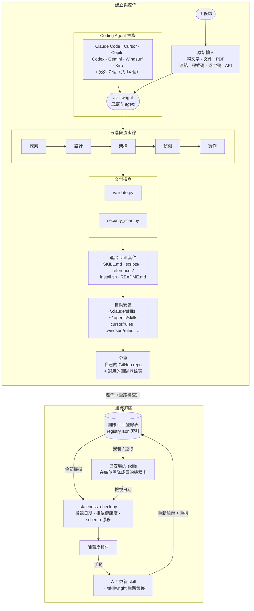

# Skillwright

> 繁體中文（台灣）｜[English](README.md)

## 快速開始

### 1. 安裝

```bash
# 一行指令 — 自動安裝到所有偵測到的工具
curl -fsSL https://raw.githubusercontent.com/codetail-ai/skillwright/master/scripts/bootstrap.sh | sh
```

或手動 clone（依你使用的工具選擇路徑）：

```bash
# Claude Code + VS Code Copilot（共用路徑）
git clone https://github.com/codetail-ai/skillwright.git ~/.claude/skills/skillwright

# Codex / Gemini / Kiro / Antigravity（通用路徑）
git clone https://github.com/codetail-ai/skillwright.git ~/.agents/skills/skillwright

# Cursor（每個專案各自設定）
git clone https://github.com/codetail-ai/skillwright.git .cursor/rules/skillwright
```

已經 clone 過了？執行 `./install.sh` 會自動建立 symlink 到所有偵測到的平台（支援 `--dry-run`、`--uninstall`）。完整的平台對照表請見 [所有平台](#所有平台)。

### 2. 使用方式

打開你的 agent，輸入 `/skillwright` 後接上你的原始素材。**這不是 prompt 範本** — Skillwright 會實際開啟檔案、抓取 URL、解析 PDF、分析程式碼，然後根據它**真正找到的內容**（而不是只看你的描述）來建立規格。

可以傳入任何類型的輸入，也可以在同一則訊息中混合多種：

| 輸入類型 | 範例 |
|---|---|
| **純文字描述** | `/skillwright 我每週都要從 CRM 撈銷售資料、去重複、計算各區域總額，然後產出 PDF 報表。` |
| **文件 / wiki 連結** | `/skillwright 根據我們的部署 runbook：https://wiki.internal/deploy-process` |
| **既有程式碼** | `/skillwright 看一下 scripts/invoice_processor.py — 把它變成一個可重用的 skill。` |
| **PDF** | `/skillwright 用 compliance-checklist.pdf 幫我做一個 SOX 稽核的 skill。` |
| **API 文件** | `/skillwright 這是我們的 API 文件：https://api.internal/docs — 做一個查詢庫存的 skill。` |
| **資料庫 schema** | `/skillwright 讀 schema.sql；建立一個能依此產出每月財務報表的 skill。` |
| **會議逐字稿** | `/skillwright transcripts/standup-q1.txt — 從中萃取我們提到的部署 runbook，做成 skill。` |
| **整個目錄** | `/skillwright 看一下 ./migrations/ — 建立一個跑 dry-run migration 計畫的 skill。` |
| **多來源組合** | `/skillwright 看 runbook.md + scripts/deploy.py + https://status.internal/api — 做出一鍵部署的 skill。` |

你提供的來源越多，產出的 skill 就越精準。Skillwright 會先把所有來源整合成一份內部規格，才開始寫程式。

### 3. 你會得到什麼

```
sales-report-skill/
├── SKILL.md          # 定義（用 /sales-report-skill 啟動）
├── scripts/          # 實際運作的程式碼
├── references/       # 需要時才載入的文件
├── assets/           # 範本、設定檔
├── install.sh        # 跨平台安裝腳本（14 個工具）
└── README.md
```

Skill 會自動安裝到你目前的平台，並告訴你怎麼呼叫它。產生的 `install.sh` 涵蓋全部 14 種工具、自動為 Cursor（`.mdc`）和 Windsurf 產生格式轉換器，並建立 `~/.agents/skills/` 的 symlink 讓多個工具共用。

---

## 運作原理

人類描述的是自己**做了什麼**，而不是**需要什麼**。Skillwright 會在動手寫程式前，先挖出隱含的需求（誰會看輸出、要什麼格式、缺資料時怎麼辦）。每一個 skill 在交付前都會經過驗證（結構、命名、metadata）和安全掃描（不能有金鑰、憑證、注入風險）— 安裝後則由維護迴圈定期執行陳舊度檢查。



---

## 跨團隊分享

建立完成後，agent 會詢問是否建立 repo 並推上去。你會得到一行指令可以分享：

```
git clone https://github.com/your-org/sales-report-skill.git ~/.agents/skills/sales-report-skill
```

貼到 Slack。同事貼到 terminal。完成。安裝在 `~/.agents/skills/` 的一份就同時涵蓋 Codex、Gemini、Kiro 和 Antigravity。

### 團隊 skill 登錄表

當你有不只幾個 skill 時，建議建立一個共用的登錄表 — 一個讓大家發佈和瀏覽的 git repo：

```bash
python3 scripts/skill_registry.py init --name "Acme Corp Skills"
python3 scripts/skill_registry.py publish ./sales-report-skill/ --tags sales,reports
python3 scripts/skill_registry.py list
python3 scripts/skill_registry.py install sales-report-skill
```

只是一個放在 GitHub 或 GitLab 上的 git repo — 不需要伺服器，也不需要資料庫。

**對顧問來說：** 合作模式是「教學，而非代做」。在每台機器上安裝 creator、設好團隊登錄表、教會大家「安裝 → 建立 → 發佈 → 安裝」的循環，留下一個能自我維持的系統。

---

## 所有平台

Skill 是以 **SKILL.md**（開放標準）撰寫。安裝程式會處理任何格式轉換。

| 等級 | 平台 | 處理方式 |
|------|-----------|----------|
| **原生** | Claude Code、Copilot、Codex CLI、Gemini CLI、Kiro、Antigravity、Goose、OpenCode | 直接讀取 SKILL.md |
| **自動轉換** | Cursor、Windsurf、Cline、Roo Code、Trae | 安裝程式自動轉成原生格式 |
| **手動** | Zed、Junie、Aider | 將 skill 內容複製到工具設定中 |

### 路徑

| 範圍 | 路徑 |
|-------|------|
| 通用（Codex/Gemini/Kiro/Antigravity） | `~/.agents/skills/` |
| Claude Code + VS Code Copilot | `~/.claude/skills/` |
| Gemini CLI | `~/.gemini/skills/` |
| Goose | `~/.config/goose/skills/` |
| OpenCode | `~/.config/opencode/skills/` |
| Cursor | `.cursor/rules/`（每個專案各自） |
| Windsurf | `.windsurf/rules/` |
| Cline / Kiro / Trae / Roo | `.clinerules/`、`.kiro/skills/`、`.trae/rules/`、`.roo/rules/` |

VS Code Copilot 1.108+ 預設會讀取 `~/.claude/skills/` — 一次安裝兩邊都能用。

**Cursor 全域變通方法：** Cursor 沒有全域目錄。先 clone 到 `~/agent-skills/`，再為每個專案建立 symlink：

```bash
alias install-skills='mkdir -p .cursor/rules && ln -s ~/agent-skills/skillwright .cursor/rules/skillwright'
```

### 產出的 skill 安裝腳本

```bash
./install.sh                    # 自動偵測
./install.sh --all              # 全部安裝
./install.sh --platform cursor  # 指定平台
./install.sh --dry-run
```

### Claude Desktop / claude.ai

```bash
python3 scripts/export_utils.py ./skillwright/ --variant desktop
# 然後：設定 > Skills > 上傳 .zip
```

### 更新

```bash
cd ~/.agents/skills/skillwright && git pull
```

Symlink 會自動生效。Skill 在載入時也會默默做一次版本檢查。

---

## 品質檢查

每個 skill 在交付前和每次發佈時都會經過以下檢查：

| 檢查項目 | 內容 |
|------|--------|
| **規格** | SKILL.md 結構、frontmatter、命名、檔案參考 |
| **安全** | 寫死的金鑰、憑證、注入模式 |
| **陳舊度** | 檢視日期、相依健康度、API schema 漂移 |

```bash
python3 scripts/validate.py ./my-skill/
python3 scripts/security_scan.py ./my-skill/
python3 scripts/staleness_check.py ./my-skill/ --check-deps --check-drift
```

驗證失敗會擋下發佈。高風險的安全問題會擋下交付。

---

## 陳舊度偵測

API 會變、合規規則會更新、資料來源會搬家。三個可選的層級會在使用者遇到問題之前先把腐壞攤出來：

- **檢視追蹤** — 比對 `last_reviewed` + `review_interval_days` 與今天（沒設定的話會用 git commit 日期）。
- **`--check-deps`** — 用 HTTP 檢查 frontmatter 裡宣告的 URL。
- **`--check-drift`** — 抓取 endpoint，比對實際的最上層 key 與 `expected_keys`。

選用的 frontmatter（既有的 skill 不需修改即可運作）：

```yaml
metadata:
  last_reviewed: 2026-02-27
  review_interval_days: 90
  dependencies:
    - url: https://api.example.com/v1
      name: Example API
  schema_expectations:
    - url: https://api.example.com/v1/data
      expected_keys: [id, price, volume]
```

一次掃描整個登錄表：`python3 scripts/skill_registry.py stale [--json]`。

---

## 工具參考

### 登錄表

```bash
python3 scripts/skill_registry.py init --name "Acme Corp Skills"
python3 scripts/skill_registry.py publish ./skill/ --tags t1,t2
python3 scripts/skill_registry.py list | search "q" | info <name> | install <name>
python3 scripts/skill_registry.py remove <name> --force
python3 scripts/skill_registry.py stale [--json]
```

### 驗證 / 安全 / 陳舊度

```bash
python3 scripts/validate.py ./skill/ [--json]
python3 scripts/security_scan.py ./skill/ [--json]
python3 scripts/staleness_check.py ./skill/ [--check-deps] [--check-drift] [--json]
```

### 通用安裝程式（任何 skill、任何工具）

```bash
./scripts/install-skill.sh <git-url-或-路徑>
./scripts/install-skill.sh <path> --platform cursor --project
./scripts/install-skill.sh <path> --dry-run | --uninstall
```

### 匯出

```bash
python3 scripts/export_utils.py ./skill/ --variant desktop  # Claude Desktop
python3 scripts/export_utils.py ./skill/ --variant api      # Claude API
```

退出碼 `0` 表示成功、`1` 表示錯誤。所有指令都支援 `--json` 給 CI 使用。

---

## 疑難排解

- **Skill 沒有啟動** — 檢查 SKILL.md 裡的 `description` 是否包含與你查詢相符的關鍵字。
- **名稱驗證** — 小寫、連字號、1–64 個字元（例如 `sales-report-skill`）。
- **SKILL.md 太長** — 把細節搬到 `references/` 檔案裡再連結過去。
- **平台沒被偵測到** — 用 `--platform <name>` 明確指定。
- **一次安裝到所有地方** — 在任何產出的 skill 裡跑 `./install.sh --all`。

---

## 專案結構

```
skillwright/
  SKILL.md                      # Agent 讀取的內容
  install.sh                    # Symlink 自我安裝
  scripts/
    bootstrap.sh                # Curl 一行指令 bootstrap
    install-skill.sh            # 通用 skill 安裝程式
    install-template.sh         # 給產出之安裝程式用的範本
    validate.py
    security_scan.py
    staleness_check.py
    export_utils.py
    skill_registry.py
  references/                   # Agent 視需要載入
    pipeline-phases.md
    architecture-guide.md
    quality-standards.md
    multi-agent-guide.md
    cross-platform-guide.md
    export-guide.md
    templates-guide.md
    interactive-mode.md
    agentdb-integration.md
    phase{1-5}-*.md             # 每個階段的深入說明
    templates/
    examples/stock-analyzer/
  registry/                     # 共用的 skill 目錄
  exports/                      # 匯出產物
```
