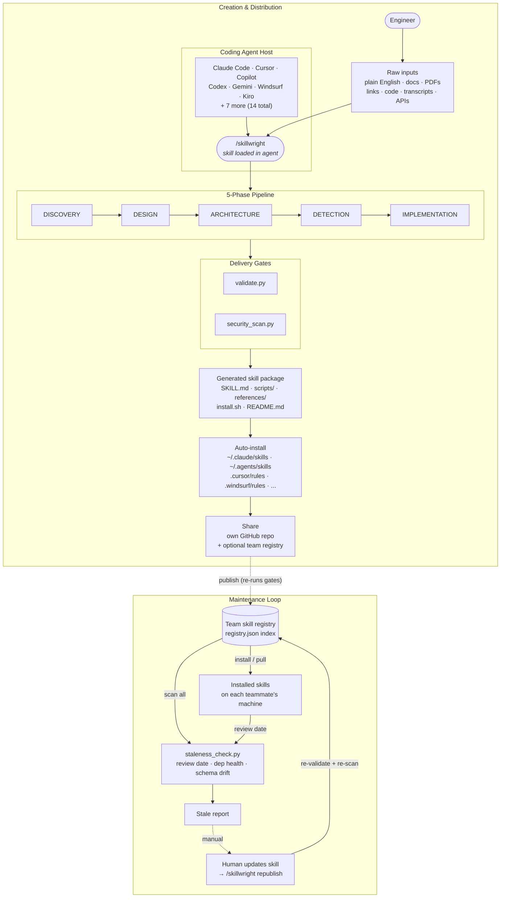

```mermaid
flowchart TB
    %% =======================================
    %% TOP: CREATION & DISTRIBUTION
    %% =======================================
    subgraph OPERATION["Creation & Distribution"]
        direction TB

        USER(["Engineer"])
        INPUTS["Raw inputs<br/>plain English · docs · PDFs<br/>links · code · transcripts · APIs"]

        subgraph HOST["Coding Agent Host"]
            direction LR
            AGENTS["Claude Code · Cursor · Copilot<br/>Codex · Gemini · Windsurf · Kiro<br/>+ 7 more (14 total)"]
            SW(["/skillwright<br/><i>skill loaded in agent</i>"])
            AGENTS --> SW
        end

        subgraph PIPE["5-Phase Pipeline"]
            direction LR
            P1["DISCOVERY"] --> P2["DESIGN"] --> P3["ARCHITECTURE"] --> P4["DETECTION"] --> P5["IMPLEMENTATION"]
        end

        subgraph GATES["Delivery Gates"]
            direction LR
            V["validate.py"]
            S["security_scan.py"]
        end

        OUT["Generated skill package<br/>SKILL.md · scripts/ · references/<br/>install.sh · README.md"]

        INSTALL["Auto-install<br/>~/.claude/skills · ~/.agents/skills<br/>.cursor/rules · .windsurf/rules · ..."]

        SHARE["Share<br/>own GitHub repo<br/>+ optional team registry"]

        USER --> INPUTS --> SW
        SW --> PIPE --> GATES --> OUT --> INSTALL --> SHARE
    end

    %% =======================================
    %% BOTTOM: MAINTENANCE LOOP
    %% =======================================
    subgraph EVOLUTION["Maintenance Loop"]
        direction LR

        INSTALLED["Installed skills<br/>on each teammate's machine"]
        REGISTRY[("Team skill registry<br/>registry.json index")]
        STALENESS["staleness_check.py<br/>review date · dep health · schema drift"]
        REPORT["Stale report"]
        UPDATE["Human updates skill<br/>→ /skillwright republish"]

        REGISTRY -->|"scan all"| STALENESS
        INSTALLED -->|"review date"| STALENESS
        STALENESS --> REPORT
        REPORT -.->|"manual"| UPDATE
        UPDATE -->|"re-validate + re-scan"| REGISTRY
        REGISTRY -->|"install / pull"| INSTALLED
    end

    SHARE -.->|"publish (re-runs gates)"| REGISTRY
```